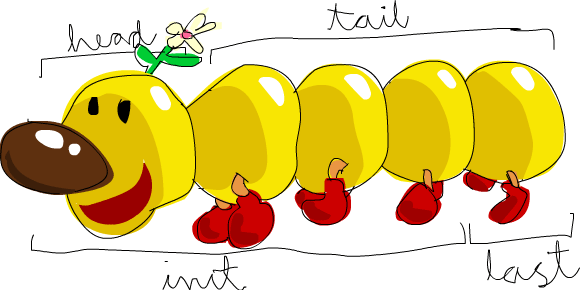

# The terminal with the [Glascow Haskell Compiler (GHC)](https://www.haskell.org/ghc/)

## Arithmetics

Once the compiler is installed, many arithmetics similar to what you could do in node, can also be done such as `5 + 5 = 10`, `5^5 = 3125`, `5 * (-3) = -15`, and even boolean operations and equalities. 

But not `5 + "llama"` or even `5 + "4"` and `True == 5` since types don't match at all. Still, some work can be made with `5 + 0.4` as numbers could be changed around.

## Functions

So far, we did no "functions" but yet, we actually did with `*` and `+` which are called ***infix*** functions, that are sandwiched between two numbers and gets out the result.

Others are called ***prefix*** functions, which are of syntax `name parameter parameter` with spaces as separation.

These prefix functions with two arguments can still work as an infix, quite neat right?

Sequential functions are run with parenthesis, and unlike other languages, does not denote arguments at all as `bar (bar 3)` is not `bar` and `3` as arguments and is instead `bar` calling `bar 3` after `bar 3` gets evaluated.

### No Matter How Mundane

Functionify it, the building block of all complex funtions starts with `doubleMe x = x + x` and `doubleUs x y = doubleMe x + doubleMe y`, instead of `doubleUs x y = x*2 + y*2`, So that you could, if you thought of changing how doubling works, change the basic `doubleMe` to affect the rest of the structure automatically.

### Conditionally return stuff

Because even in static typing functional programming, wanting different behavior from the same function is always needed to reduce the amount of code to write.

```haskell
doubleSmallNumber x = if x > 100  
                        then x  
                        else x*2   
```

&

```haskell
doubleSmallNumber' x = (if x > 100 then x else x*2) + 1  
```

### Functional Tips

Function expressions can be defined with no regard to their order, since they are mostly `lazy` after all.

`'` is commonly added, where the function does something similar to a previous implementation, or a way to say that this expression is not `lazy`.

And functions are named with `camelCase` and not `PascalCase`, since the latter is usually reserved for type definitions.

## Working Out the List of Needs

> Arrays in Javacript, bye.
>
> Lists in Hakell, welcome

**Homogenous**, and **infinite** are the selling point. And guess what, strings are already lists of individual letters, so all list functions apply too.

### Ops on Lists

`++` does the work of concatenating and joining lists and only lists, however its a small process of reading the full left side of the concatenation then appending the right side to it.

`:` appends a string or number or any type on the left side, to its corresponding valid list on the right instantaneously.

`!!` works out the value at a certain index after it with the syntax `List !! index`. Make sure to get a valid index otherwise it will throw an error.

Nested lists can still contain different lengths of lists, but all within the same type.

### Comparisons, And Why Its Weird

Take a look as a non Haskeller, and then notice what I mean.

```haskell
ghci> [3,2,1] > [2,1,0]  
True  
ghci> [3,2,1] > [2,10,100]  
True  
ghci> [3,4,2] > [3,4]  
True  
ghci> [3,4,2] > [2,4]  
True  
ghci> [3,4,2] == [3,4,2]  
True  
ghci> [3,4,2] == [3,4,1]  
False
```
Apparently, the decision making of Haskell when it compares two lists is [as follow: ](https://stackoverflow.com/questions/3651144/comparing-lists-in-haskell-or-more-specifically-what-is-lexicographical-order). Lexicographical means to *check the first index of both lists then the next index of both and so on*, but only move the index if the values are equal, otherwise try and make a decision at that index if they are not.

Oh and here is a couple of functions we can pass lists to, such as `head [5,4,3,2,1]` to get 5. Beware of using it with empty lists otherwise you would get the ***`ERROR`***.



A couple more such as:

- `length` obvious.
- `null` checks for empty list.
- `reverse` as name suggests.
- `take` gets you x elements into list from start.
- `drop` removes x elements from start of the list.
- `maximum` and `minimum` wont even try to explain that.
- `sum` for a list of numbers only.
- `product` look above.
- `elem` as an infix `4 'elem' [3,4,5]` to check its existence in that list.

### Welcome to the Cool Ranger Stuff

Now the real, real selling point of lists in Haskell, is the ability to produce lists based on ***range***. Where any enumerable number can be generated as long as its easily predictable such as:

- `[1..10]` giving us the numbers 1 to 10.
- `['a'..'z']` returning all characters from `'a'` to `'z'`.
- `[2,4..20]` solves for x*2 as a predicted increment.
- `[0.1, 0.3 .. 1]` unexpectedly returns values from `0.1` to `1.0999999999`, as it seems that the result is returned immediately then is stopped, disregarding the condition and with precision issues.
- with `take 24 [13,26..]` will return an infinite list, but because of lazy evaluation that list is never resolved to infinity and instead stops at the 24th iteration, as requested.

More functions such as `cycle` that infinitely repeats provided array so a cutoff is needed. Along with `repeat` for one value. But if you just need a specific length of a repeated value might as well use `replicate 3 10` where the result is `[10,10,10]`.

### Comprehension as a Special List

Well defined lists are usually done with a for loop along with a push function, that 3 line mess could be converted to a single line in Haskell called a *list comprehension*. Its a special list that has a well defined increment, a range of values, and the condition of which that value must satisfy. 

`[x*2 | x <- [1..10], x*2 >= 12]` returns `[12,14,16,18,20]`.


This does really look like an easier way to transform and filter values in a mathematical way, rather than declaratively with maps and filters.

Chaining conditions or **predicates** is easily done with additional commas `[ x | x <- [10..20], x /= 13, x /= 15, x /= 19]` so that all gets to be fulfilled before returning.

Multiple arrays can be used to produce a resulting value depending on the increment or output function. Such as if its a multiplication all values will be doing matrices multiplication.

`[ x | x <- [10..20], x /= 13, x /= 15, x /= 19]` so the results be the 1x9 array `[10,11,12,14,16,17,18,20]`.

Take this matrix multiplication of nouns and adjectives, and realize the potential.

```haskell
ghci> let nouns = ["hobo","frog","pope"]  
ghci> let adjectives = ["lazy","grouchy","scheming"]  
ghci> [adjective ++ " " ++ noun | adjective <- adjectives, noun <- nouns]  
["lazy hobo","lazy frog","lazy pope","grouchy hobo","grouchy frog", "grouchy pope","scheming hobo","scheming frog","scheming pope"]   
```

combining these comprehensions with other functions such as sum could be used to make neat customized combination such as this `length'` function.

`length' xs = sum [1 | _ <- xs]` where `_` denotes an unused variable since all list values will be replaced by 1 and then summed up.

## Working out Haskell Tuples 

Such as arrays of lists and tuples, both are visually similar, but work differently under the hood. While lists do care about *type uniformity* but not *size*, tuples don't care about type, but do on sizes, and is best used that way. They are denoted with `(a,b,c)` parenthesis, and comma separated values.

A list of vectors could be done with lists only, such as `[[1,2], [2,3]]` but nothing stops the array values from changing and expanding, a way to constraint the list values is to add tuples inside with `[(1,2),(3,4)]` so that it actually is mathematically correct and is limited to act as 2D vectors.

This type of rigidity helps serve as a compile time check that is otherwise not possible with lists, thus it also requires ways to handle different tuples, differently. Comparisons also work with similar sized tuples.

Some functions such as `fst`, and `snd` returns the first and second value from a tuple of 2 (pair).

Now with `zip`  works as it implies, by joining two lists and creating pair tuples with simultaneous traversal of both lists. The zipped list of tuples takes the length the shorter list of both and discards the rest.

## Final Boss

To fully understand what has been discussed, a combination of list comprehension and tuples will be used in finding all possible combinations of 3-value tuple, representing the sides of triangle.

The tuple must satisfy so that:

- All 3 sides of the triangle are smaller or equal to 10
- Has all of sides combined to be less than 24.
- Is a right angle so that two sides squared is equal to third side squared.

The 3 equations form the list comprehension required, with `(a,b,c)` as the expected list output.

```haskell
ghci> let rightTriangles' = [ (a,b,c) | c <- [1..10], b <- [1..c], a <- [1..b], a^2 + b^2 == c^2, a+b+c == 24]  
ghci> rightTriangles'  
[(6,8,10)]  
```
## [Lists Done. Next Stop Types](static-beings.md)